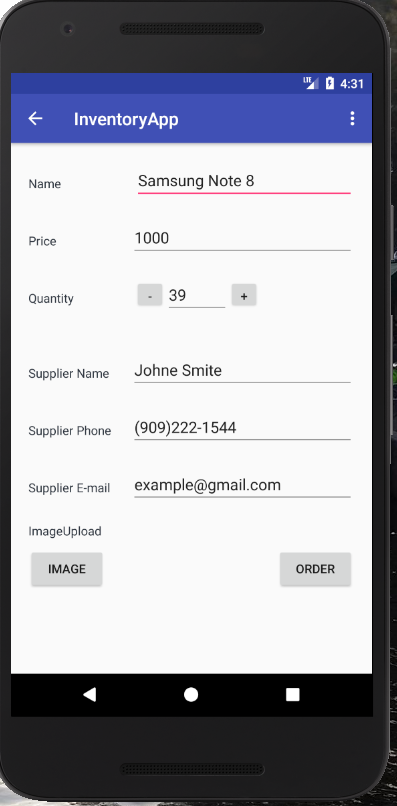

# Inventory Application
	Inventory App Project of Android Basics: Data Storage

# Things used in this project
	SQLite 
	Cursors
	CursorAdapter
	ListView
	CRUD: Create, Read, Update, Delete for database items for dummy data or entered data.
	permission

# Description
	Keeping track of inventory
	Selling inventory with a click of a button
	Insert new inventory
	Edit inventory item
	Display image of inventory in ListView
	Update inventory
	Delete all inventory or just selected inventory
	Order more item from supplier with email or phone number
	Upload images with item when entering new product
	
	# Screenshot

	
	
